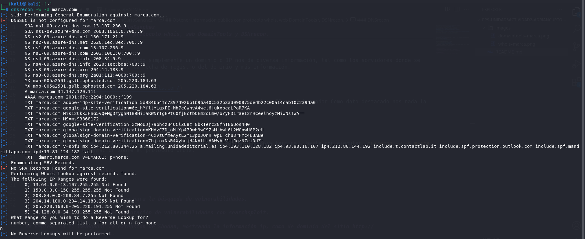

# PPS-Unidad3Actividad2-AdrianCurtoSanchez

- [Obtener información pública con protocolo whois, web DoaminTools y DSNrecon.](#obtener-información-pública-con-protocolo-whois-web-doamintools-y-dsnrecon)
- [Cómo utilizar Nmap y nikto.](#cómo-utilizar-nmap-y-nikto)
- [Cómo utilizar Wfuzz, Dirb.](#cómo-utilizar-wfuzz-dirb)
- [Utilización de scripts con Nmap para la búsqueda de vulnerabilidades.](#utilización-de-scripts-con-nmap-para-la-búsqueda-de-vulnerabilidades)
- [Busqueda de información de explotación de vulnerabilidades con searchsploit.](#busqueda-de-información-de-explotación-de-vulnerabilidades-con-searchsploit)
- [Emplear en el navegador la extensión de Shodan, mostrando la información ip, como de dominio del sitio http://iesvalledeljerteplasencia.es.](#emplear-en-el-navegador-la-extensión-de-shodan-mostrando-la-información-ip-como-de-dominio-del-sitio-httpiesvalledeljerteplasenciaes)
-[Sobre la red del laboratorio PPS con kali, bWAPP, Multidillae y DVWA](#sobre-la-red-del-laboratorio-pps-con-kali-bwapp-multidillae-y-dvwa)

## Obtener información pública con protocolo whois, web DomainTools y DSNrecon.

- ### [Who.is](https://who.is/)

Con la herramienta who.is introduciendo simplemente un dominio o IP nos da diversa información, tal como los sorvidores donde se encuentran alojados los servicios, la fecha de registro del dominio y más información.

- ### [DomainTools](https://whois.domaintools.com/)

Esta herramienta es similar a la anterior, simplemente introducimos un dominio o IP en el buscador.Como dato destacado nos nada la ubicación de los servidores y los cambios de hosting.

- ### [Dnsrecon](https://www.kali.org/tools/dnsrecon/)

Es una herramienta avanzada que incorpora Kali Linux. Se ejecuta desde la propia terminal, basta con ejecutar `dnsrecon -w -d marca.com` para obtener información sobre el protocolo whois. Requiere de conocimientos más técnicos para poder explotar todo su potenial.

## Cómo utilizar Nmap y nikto.

- ### [Nmap](https://www.kali.org/tools/nmap/)

Nmap escanear puertos, detección de versiones de aplicaciones que se encuentran tras de los puertos, sistemas operativos o identificación de dispositivos.
El descubrimiento de equipos se realizaría con el comando `nmap 192.168.0.0/24` dentro del rango de IP indicado buscaría obteniendo algo similar a la siguiente captura.

- ### [Nikto](https://www.kali.org/tools/nikto/)

## Cómo utilizar Wfuzz, Dirb.

## Utilización de scripts con Nmap para la búsqueda de vulnerabilidades.

## Busqueda de información de explotación de vulnerabilidades con searchsploit.

## Emplear en el navegador la extensión de Shodan, mostrando la información ip, como de dominio del sitio http://iesvalledeljerteplasencia.es.

## Sobre la red del laboratorio PPS con kali, bWAPP, Multidillae y DVWA:< 
